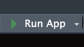

```{r setup, include=FALSE}

knitr::opts_chunk$set(
  echo = TRUE,
  eval = TRUE,
  message=FALSE, 
  warning=FALSE, 
  fig.width = 10,
  fig.align = "center"
  )

library( DWVpack )
library( tidyverse )
library( dplyr )
library( ggplot2 )
library( scales )

```

# Dynamic Visualization using Shiny {.unnumbered}

Up to this point, most of the tools we have developed have been designed for **you**, the analyst.
We learned how to take wild data and make them tidy, use `dplyr` to build reproducible data recipes, transform variables into useful forms, and use `ggplot2` to identify and communicate patterns.
We then expanded those visualization skills by thinking about how design choices can help us tell a story with data.

But what happens when the person who needs the information is *not* the analyst?
Imagine that you have been asked to examine crime trends for a police department.
You clean and transform the data, summarize incidents by month and crime type, create a visualization showing how crime has changed over time, and then you send the visualization to a patrol commander.
The commander looks at it and asks: "Can I see this for just 2024?" So, you filter the data, rerun your code, recreate the visualization, and send another figure.
Then another question arrives: "What about just burglaries?" Then: "Can I compare burglaries and motor vehicle theft?" Then: "Can I look at a different year?"

You could continue producing a new visualization every time the question changes.
*Or*, you could give the user a way to explore those questions themselves.
This is where **Shiny** comes in.

Shiny allows us to take the data wrangling and visualization tools we have already learned and place them inside an *interactive* application.
Instead of creating one static visualization with choices determined entirely by the analyst, we can allow users to make some of those choices themselves.
A supervisor might select a year from a dropdown menu, choose a crime type, specify a date range, or adjust some other feature of the analysis.
The application can then respond automatically by filtering the data, performing the necessary calculations, and updating the visualization.

Importantly, we are *not* starting over or abandoning the tools we learned in previous chapters.
Shiny brings those tools together.

For example, think about what happens when a user selects "2024" from a dropdown menu.
Behind the scenes, we might use:

- `filter()` from `dplyr` to select incidents from 2024,
- `group_by()` and `summarize()` to calculate the information we want to display, and
- `ggplot2` to create a visualization from those results.

Sound familiar?
The major difference is that the person using the application can now change the input.
When the input changes, Shiny reruns the necessary parts of our data recipe and updates the output.

This makes Shiny particularly useful for crime analysts.
Crime analysis frequently involves recurring questions about **when**, **where**, and **what types** of incidents are occurring.
Different users may also need different views of the same underlying data.
A patrol commander, crime analyst, city manager, or member of the public may all be interested in the same dataset but want to ask different questions of it.
An interactive application provides a way to give those users controlled access to the analytical workflow you have created without requiring them to write R code themselves.

In that sense, this chapter represents an important transition in the book.
Earlier chapters focused largely on building the analyst's toolkit.
Now we are going to use those tools to build something that *someone else* can use.

Before building our first crime analysis application, let's start with a simple example that illustrates the fundamental idea behind Shiny: the difference between a visualization that we create for someone and one that someone can interact with themselves.

## Motivating Question {.unnumbered}

In statistics, you learned that when we sample, we want large sample sizes.
Why?

Let's see this in practice.
If we drew $k = 2000$ random samples of size $n = 2$, $n = 10$, and $n = 50$, respectively, we would get three sampling distributions.
We could then visualize each sampling distribution with a `ggplot2`:

```{r gplot-example, echo=FALSE}

set.seed( 2026 )
sigma <- 1
n_reps <- 2000

df <- do.call( 
  rbind, 
  lapply( c(2, 10, 50), function( n ) {
    means <- replicate( n_reps, mean( rnorm( n, mean = 0, sd = sigma ) ) )
    data.frame( n = as.factor( n ), sample_mean = means )
    }
    ) 
  )

ggplot( 
  df, 
  aes( x = sample_mean, fill = n ) ) +
  geom_histogram( bins = 30, alpha = 0.6, position = "identity" ) +
  facet_wrap( ~ n, nrow = 1 ) +
  labs( 
    title = "", 
    x = "Sample mean", y = "" ) +
  theme_minimal() 

```

Take a look at each plot.
What is the visualization showing you?
By displaying this information visually, what do you learn?

Now, take a look at a different way of using a visualization to convey this point: [visualization of sampling distributions](https://jacobtnyoung.shinyapps.io/sampling-distributions/){target="_blank" rel="noopener"}.

<br>

## Static vs. Dynamic Visualization

The visualizations above are examples of static and dynamic visualizations, respectively.
What makes the latter visualization *dynamic* is that the user can alter the inputs to change what the visualization shows.
It is not simply fixed by the author/developer/etc, it is interactive: the **user** is able to alter what is *rendered*.

## Other examples...

What if you were interested in:

- identifying an optimal strategy for network disruption (check out this [network disruption app](https://jacobtnyoung.shinyapps.io/network-disruption/){target="_blank" rel="noopener"})
- the spatial distribution of crime in Phoenix (check out this [Phoenix Crime Dashboard](https://jacobtnyoung.shinyapps.io/crime-in-phx/){target="_blank" rel="noopener"})

These are all built using [Shiny](https://shiny.posit.co/){target="_blank" rel="noopener"}!

<br>

# What is Shiny and How it Works

Shiny is an R framework for building interactive web applications directly from R code.
It allows you to take static analyses and visualizations, like a `ggplot2`, and turn them into user-driven applications that run in a web browser.

With Shiny, users can:

- Adjust inputs (sliders, dropdowns, buttons)
- Filter data
- Change model parameters
- Instantly see updated visualizations and results

## Core Concepts

Shiny apps are built around three simple ideas:

- The UI (User Interface), which is what the user sees.
  It includes the layout of the page, input controls (sliders, dropdowns, checkboxes), and output placeholders (where plots, tables, or text will appear).
  The UI defines the structure of the app.

- The Server, this is what happens behind the scenes.
  It is where we put the instructions for what is produced in the UI, where data is processed, and where calculations happen.
  The server connects user inputs to outputs.

- Reactivity is what makes Shiny dynamic (and powerful).
  Reactivity means that code reruns automatically when inputs change.
  Think of it like Excel cell recalculation: If one cell changes, any dependent cells update automatically.
  Shiny works the same way in that changes to the inputs trigger update which refresh the output.

Let's go back to the [visualization of sampling distributions](https://jacobtnyoung.shinyapps.io/sampling-distributions/){target="_blank" rel="noopener"} app and take a closer look.
Now, take a closer look "under the hood" to see what it looks like [here](https://github.com/jacobtnyoung/dynamic-viz/blob/main/apps/sampling/app.R){target="_blank" rel="noopener"}.

## An Example

### Static Visualization

Suppose we created a plot using this code:

``` r

library( ggplot2 )

n <- 100

x <- rnorm( n )

ggplot(data.frame(x = x), aes(x = x)) +
      geom_histogram(bins = 30, fill = "steelblue", alpha = 0.7) +
      labs(title = paste("Histogram of", n, "random normals"),
           x = "value", y = "count") +
      theme_minimal()
```

We have a very simple plot of random draws from a standard normal distribution.
What if we wanted to increase the number we took?
Decrease it?

### Dynamic Visualization

Let's create a very simple Shiny app.
As we do this, ask yourself: What is part of the UI?
What is part of the server?
Where is reactivity happening?

To get started, install `shiny` using `install.packages( "shiny" )`.
Then, create a new R script file and add this code to it:

``` r

library( shiny )
library( ggplot2 )

ui <- fluidPage(
  titlePanel("Interactive Histogram"),
  sidebarLayout(
    sidebarPanel(
      sliderInput("n", "Sample size (n):", min = 10, max = 1000, value = 100, step = 10)
    ),
    mainPanel(
      plotOutput("hist")
    )
  )
)

server <- function(input, output) {
  output$hist <- renderPlot({
    x <- rnorm(input$n)
    ggplot(data.frame(x = x), aes(x = x)) +
      geom_histogram(bins = 30, fill = "steelblue", alpha = 0.7) +
      labs(title = paste("Histogram of", input$n, "random normals"),
           x = "value", y = "count") +
      theme_minimal()
  })
}

shinyApp(ui = ui, server = server)
```

Now, look to the top right corner of the screen and you will see a button called "Run App" that looks like this:

::: {align="center"}
{fig-width="4in"}
:::

Click that button and watch the magic happen!

Ok, you just created your first Shiny app!
I knew you had it in you.
Let's walk through what we did.

The first part loads the libraries to get the functions needed to build the app and the plot:

``` r

library( shiny )
library( ggplot2 )
```

Next, we have our two key pieces, the `ui` and the `server`.
Let's look at the code for defining the user interface:

``` r

ui <- fluidPage(
  titlePanel("Interactive Histogram"),
  sidebarLayout(
    sidebarPanel(
      sliderInput("n", "Sample size (n):", min = 10, max = 1000, value = 100, step = 10)
    ),
    mainPanel(
      plotOutput("hist")
    )
  )
)
```

We are first defining an object called `ui` which will define the user interface.
Look at your app and see what the user side features are.
Can you find them in the code?

We start the user interface with the `fluidPage()` function.
Inside this function we have `titlePanel()` which gives the title.

We then we have `sidebarLayout()` which prepares the sidebar.
Inside the sidebar layout we have `sidebarPanel()` that has `sliderInput()` inside it.
*What does this line do?* Look at the app and think about what is happening.

Finally, we have the `mainPanel()` function with the `plotOutput()` function designating an object `"hist"` to be plotted.

Now, let's examine the server side:

``` r

server <- function(input, output) {
  output$hist <- renderPlot({
    x <- rnorm(input$n)
    ggplot(data.frame(x = x), aes(x = x)) +
      geom_histogram(bins = 30, fill = "steelblue", alpha = 0.7) +
      labs(title = paste("Histogram of", input$n, "random normals"),
           x = "value", y = "count") +
      theme_minimal()
  })
}
```

We define a **function** called `server` which is going to be our workhorse.
It is going to take an `input` that the user can alter in the UI.
Anytime a change is made by the user, this is going to pass through our server object and change what is rendered in `output`.

Remember that we defined an object called `"hist"` in UI using `plotOutput()`.
Here we are defining what that will be.
Specifically, we use the `renderPlot()` function.

This is getting a bit more complicated, so let's take each line:

- `x <- rnorm(input$n)` creates an object `x`, which is a random draw from a normal distribution, `rnorm`, where the size is defined by the user with `input$n`. Look back to the UI, where do you see `"n"`? **Look at what we just did**: we built into our plot function the changes that are being made by the user in the UI. This is called a **reactive value**.
- `ggplot(data.frame(x = x), aes(x = x)) +`... defines a plot object, using `ggplot()`, that is based on the `x` object.

And that is really it.
Much of the code is tweaking the `ggplot` object.

Now for our last piece:

``` r
shinyApp(ui = ui, server = server)
```

Here, we are just running the `shinyApp()` function and defining the arguments that function needs to operate: the UI and the server.

# A Deeper Dive

Ok, that was a lot.
What we want to do now is go back through the key parts of how shiny works in greater detail.
We covered everything quickly above because I wanted you to have a sense of the scope of what we are doing.
Now, we can go in more depth and think about what is occurring at each component.

## User Interface

As a reminder, the User Interface (UI) controls what the user sees, where things appear, what users can click/type/select, etc.
The UI does not perform calculations, rather it displays content, collects user input, organizes layout, and so on.

Most Shiny apps start with:

``` r

ui <- fluidPage(

)
```

In this setup, `fluidPage()` creates the webpage and everything inside it appears on the screen.
The simplest possible UI would be something like this (try it!):

``` r

library(shiny)

ui <- fluidPage(
  ":)"
)

server <- function( input, output ) {

}

shinyApp( ui, server )
```

Everything inside `fluidPage()` gets rendered onto the webpage.
These elements generally fall into four categories:

- Titles/Text
- Input widgets
- Output placeholders
- Layout/organization tools

### Titles/Text

These include UI layout/display components such as `titlePanel()` (which creates a large page title); `h1()`, `h2()`, `h3()` (heading text of different sizes); and `p()` (which creates a paragraph of text).

For example, try this one:

``` r

library(shiny)

ui <- fluidPage( 
  titlePanel("Smiley Face Dashboard"),
  
  h2(":) :) :) :) "),
  
  p("This dashboard shows smiley faces")

)

server <- function( input, output ) {

}

shinyApp( ui, server )
```

### Inputs

These allow users to interact with the app and have various functions:

| Function               | Purpose                             |
|------------------------|-------------------------------------|
| `sliderInput()`        | Select numeric values with a slider |
| `numericInput()`       | Enter numbers manually              |
| `textInput()`          | Enter text                          |
| `textAreaInput()`      | Enter longer text                   |
| `selectInput()`        | Dropdown menu                       |
| `radioButtons()`       | Choose one option from buttons      |
| `checkboxInput()`      | Single TRUE/FALSE checkbox          |
| `checkboxGroupInput()` | Multiple checkbox selections        |
| `dateInput()`          | Select a date                       |
| `dateRangeInput()`     | Select a date range                 |
| `fileInput()`          | Upload files                        |
| `actionButton()`       | Clickable button                    |

All input functions have the same first argument: `inputId`.
This is the identifier used to connect the front end with the back end: if your UI has an input with ID `"name"`, the server function will access it with `input$name`.\
To illustrate, let's take a look at a few of these functions.

The `sliderInput()` function, which creates an interactive slider that allows users to select a numeric value (or range of values) by dragging a handle left or right.
The basic structure is:

``` r

sliderInput(inputId,
            label,
            min,
            max,
            value)
```

The `selectInput()` function creates a dropdown menu that allows users to choose one option from a list and is structured like this:

``` r
selectInput(inputId,
            label,
            choices)
```

Finally, `checkboxInput()` creates a single checkbox that can be either checked or unchecked and is structured as:

``` r
checkboxInput(inputId,
              label,
              value)
```

Now, let's take this a build a simple app with them:

``` r

library( shiny )

ui <- fluidPage( 
  titlePanel( "Here are some example input widgets" ),
  
  sliderInput( 
    inputId = "bins",
    label = "Number of bins:",
    min = 1,
    max = 50,
    value = 30 ),
  
  selectInput( 
    inputId = "crime",
    label = "Choose Crime Type:",
    choices = c( "Burglary",
                 "Robbery",
                 "Assault" ) 
              ),
  
  checkboxInput(
    inputId = "show_mean",
    label = "Show Mean Line",
    value = TRUE
    )
  
)

server <- function( input, output ) {
  
}

shinyApp( ui, server )
```

Ok, take a look and see what it does:

- We have a slider (from `sliderInput`) that lets us move a slider labeled "Number of bins:" (see the `label` argument) from 1 to 50 and the starting value is 30 (see the `min`, `max`, and `value` arguments)
- We have a drop-down selector (from `selectInput`) labeled "Choose Crime Type:" (see the `label` argument) that lets us select the type of crime as given in the `choices` argument
- We have a checkbox (from `checkboxInput`) that lets us check whether we want to show the line for the mean (i.e. `value = TRUE`) or not.

Recall above that the UI just handles what the user sees, it does not do any of the calculations.
You can see this by interacting with the widgets on the app.
If you move the slider, select from the drop-down, and/or check the box, nothing happens.
This is because we have not connected the ID (e.g. `input$bins` or `input$crime` or `input$show_mean`) to some output on the server side (yet).

### Outputs

Outputs in the UI create placeholders that are later filled by the server function.
Like inputs, outputs take a unique ID as their first argument: if your UI specification creates an output with ID `"plot"`, you’ll access it in the server function with `output$plot`.
Each output function on the front end is coupled with a render function in the back end.

For example, `sliderInput` above controls a slider for a histogram.
As we will see below, we will want to create a place for where that histogram goes (in which case we would use `plotOutput`).

There are three main types of output:

| Function        | Purpose        |
|-----------------|----------------|
| `plotOutput()`  | Display plots  |
| `tableOutput()` | Display tables |
| `textOutput()`  | Display text   |

For each function there is an associated rendering function:

| Function        | Purpose        |
|-----------------|----------------|
| `renderPlot()`  | creates plots  |
| `renderTable()` | creates tables |
| `renderText()`  | creates text   |

Let's illustrate using the `plotOutput` function to act as a placeholder and the `renderPlot` function to actually create the plot:

``` r

library( shiny )

ui <- fluidPage( 
  
  plotOutput( "plot" )
  
)

server <- function( input, output ) {
  
  output$plot <- renderPlot( plot( 1:5 ) )
  
}

shinyApp( ui, server )
```

Now, it is not very fancy (all it shows is a simple plot).
It is actually a *static* plot because we have not added reactivity to it.
We will come to this in the next section, but I just wanted to illustrate here what we have done.
We created something to be plotted called `"plot"` using the `plotOutput` function (in the UI), and then on the server side we linked it to `output$plot` and defined the output using the `renderPlot` function.

### Layout/organization tools

These functions organize content on the page.

| Function          | Purpose                             |
|-------------------|-------------------------------------|
| `sidebarLayout()` | Creates sidebar + main panel layout |
| `sidebarPanel()`  | Holds inputs/controls               |
| `mainPanel()`     | Holds outputs                       |
| `fluidRow()`      | Creates a horizontal row            |
| `column()`        | Creates columns within rows         |
| `tabsetPanel()`   | Creates tabs                        |
| `tabPanel()`      | Individual tab inside tabset        |
| `wellPanel()`     | Adds a bordered content box         |
| `splitLayout()`   | Side-by-side layout                 |
| `navbarPage()`    | Multi-page navigation bar app       |

As you can see, there are a number of functions that we use to build the the UI of the app.
You can browse the functions that are build in `shiny` by typing `help( package = "shiny" )`.
There are also many extensions that have been written:

- [shiny widget gallery](https://shiny.posit.co/r/gallery/widgets/widget-gallery/){target="_blank" rel="noopener"}
- [shinyWidgets](https://dreamrs.github.io/shinyWidgets/){target="_blank" rel="noopener"}
- [awesome-shiny-extensions](https://github.com/nanxstats/awesome-shiny-extensions){target="_blank" rel="noopener"}

## Connecting the UI to the Server

The **server** is where calculations happen, plots are created, tables are generated, text is modified, and reactive behavior occurs.
As we have seen it has this basic structure:

``` r

server <- function( input, output )
```

where `input` stores values coming from UI widgets and `output` stores things displayed in the UI.

Let's show how this works by first creating a toy data set with a single variable and then we will create a histogram of that variable where we can change the number of bins that are used to display the data.

First, create some data on speeding that we can use:

```{r}

# we set a random number seed so we can reproduce the results
set.seed(541)

# now create the toy data
traffic_data <- data.frame(
  speed = rnorm( 500, mean = 65, sd = 15 )
)

# look at the first 20 cases
head( traffic_data, n = 20 )

```

Now let's build the app.
I will produce the full code here so you can run it and see what it gives us and we will walk through each chunk.

``` r
library( shiny )


ui <- fluidPage(
  
  titlePanel("Traffic Speed Histogram"),
  
  sliderInput("bins",
              "Number of bins:",
              min = 5,
              max = 30,
              value = 10),
  
  plotOutput("speedPlot")
  
)

server <- function(input, output) {
  
  output$speedPlot <- renderPlot({
    
    hist(traffic_data$speed,
         breaks = input$bins,
         col = "steelblue",
         border = "white",
         main = "Distribution of Traffic Speeds",
         xlab = "Speed (mph)")
    
  })
  
}

shinyApp(ui, server)
```

Run this and play with the slider a bit.
Now let's look at what we did.

First, we created a slider using:

``` r
sliderInput("bins",
              "Number of bins:",
              min = 5,
              max = 30,
              value = 10)
  
```

Then, we added `plotOutput("speedPlot")` to tell it that it will output an object called `"speedPlot"`.
This is our UI setup, so now we need to go to the **server** and define the output object.

The first step is to define the `server` as a function of an `input` and an `output` using: `server <- function(input, output)`.

Now, we need to do two steps: define the output object, `output$speedPlot` using `renderPlot` and then to define what exactly the plot is, in this case a histogram using the `hist` function.

``` r
  output$speedPlot <- renderPlot({
    
    hist(traffic_data$speed,
         breaks = input$bins,
         col = "steelblue",
         border = "white",
         main = "Distribution of Traffic Speeds",
         xlab = "Speed (mph)")
  
```

And there we have it!
Those are our pieces.

# Putting It All Together: An Interactive Crime Analysis

Ok, let's work through this one more time drawing on a plot we created in the [Advanced `ggplot2` and Storytelling](https://jacobtnyoung.github.io/dwv4ca/dwc4ca-ggplot2-advanced.html) chapter.
If you recall, we created an object with monthly counts of each type of crime by year by using the `tidy_phx_crime` object in the `DWVpack` package.
After creating the object, we used `facet_wrap()` to panel by year:

```{r}

# build the data

crime_type_monthly <- tidy_phx_crime  |> 
  select( year, month, crime_type_clean ) |> 
  arrange( year, month, crime_type_clean ) |> 
  group_by( year, month, crime_type_clean  ) |> 
  summarize( crimes = n() , .groups = "drop" )


# render the plot

ggplot( 
  data = crime_type_monthly, 
  aes( x = month, y = crimes, group = crime_type_clean, color = factor( crime_type_clean ) ) 
  ) +
  geom_point() +
  geom_line() +
  
  # here is our faceting function at work!
  facet_wrap( ~ year  ) 
  
```

What if we wanted to allow users to select the year rather than having all of these separate panels?
There are a few ways to approach this, but one might be to use a drop-down for years.
In this case, we would use the `selectInput` function and list the years we have.
It would look like this:

``` r

selectInput( 
    inputId = "year_of_crime",
    label = "Choose Year:",
    choices = c( "2016", "2017", "2018", "2019", "2020", "2021", "2022", "2023", "2024" ),
    selected = "2024"
              )
```

We also need to set an output plot, something like this:

``` r

plotOutput( "crimePlot" )
```

We have defined the `inputId` as `year_of_crime` and that ID will be used on the server side for our function.

Let's think about what that will look like.
We need to make year dynamic in our data.
Essentially, we want to take our object `crime_type_monthly`, filter it by the year selected by the user, and then plot that.
Think about it like this: we are taking a subset of the `crime_type_monthly` object based on some condition we specify.
This is `dplyr` territory!

If we want to filter the data based on year we could just use the `filter()` function from `dplyr`, like this:

```{r}

user_selected_year <- 2022

filtered_data <- crime_type_monthly %>%
      filter( year == user_selected_year )

head( filtered_data )

```

In shiny, rather than defining the year, like `user_selected_year <- 2022` and plugging in `user_selected_year` as the filter condition, we allow the user's input to do the filtering.
So, we just need to replace the appropriate ID, like this:

``` r

filtered_data <- crime_type_monthly %>%
      filter( year == input$year_of_crime )
```

We replace `user_selected_year` with `input$year_of_crime` because that is the name of the input ID we defined in the `selectInput` function in the UI.

That is our reactive element because every time the user changes the input using the drop-down, the `filter()` function is going to rerun based on the new condition.

Our final piece is just going to be updating our `ggplot` code to reflect that we want to use `filtered_data` instead of `crime_type_monthly`

``` r

ggplot( 
  data = filtered_data, 
  aes( x = month, y = crimes, group = crime_type_clean, color = factor( crime_type_clean ) ) 
  ) +
  geom_point() +
  geom_line()
  
```

Now, let's take all of those pieces and put them together.
Here is the full code for the app:

``` r

library(shiny)
library(ggplot2)
library(dplyr)

ui <- fluidPage(
  
  selectInput( 
    inputId = "year_of_crime",
    label = "Choose Year:",
    choices = c( "2016", "2017", "2018", "2019", "2020", "2021", "2022", "2023", "2024" ),
    selected = "2024"
  ),
  
  plotOutput("crimePlot")
  
)

server <- function(input, output) {
  
  output$crimePlot <- renderPlot({
    
    filtered_data <- crime_type_monthly %>%
      filter(year == input$year_of_crime)
    
    ggplot(
      filtered_data,
      aes(
        x = month,
        y = crimes,
        group = crime_type_clean,
        color = factor(crime_type_clean)
      )
    ) +
      geom_point() +
      geom_line()
    
  })
  
}

shinyApp(ui, server)
```

## Publishing Your Shiny App with shinyapps.io

Up to this point, we have been running our Shiny apps on our own computer.
This is a great way to build and test an app, but it limits who can use it.
If you want a supervisor, colleague, community partner, or classmate to interact with your dashboard, you need a way to publish it online.
This is where **deployment** comes in.

Deployment means taking an app that works on your computer and making it available somewhere else.
For Shiny apps, one of the easiest places to publish is [shinyapps.io](https://www.shinyapps.io/), which is a hosting service from Posit.
Once your app is deployed, users can open it in a web browser just like any other website.
They do not need R, RStudio, or the code on their own computer.

This is one of the main reasons Shiny is useful for crime analysts.
A static report can show someone what you found, but an interactive dashboard lets them explore the data themselves.
For example, a user might want to filter by year, crime type, precinct, neighborhood, or month.
Instead of creating dozens of separate plots, you can build one app that lets the user select what they want to see.

### Before You Publish

Before publishing a Shiny app, make sure the app works correctly on your own computer.
Click “Run App” in RStudio and test the main features:

- Do all inputs work?
- Do the plots, tables, or text outputs update correctly?
- Are there any error messages?
- Are the labels and titles clear?
- Would someone else understand what they are looking at?

This last question is important.
When you deploy an app, the user may not be sitting next to you.
They may not know what the variables mean, where the data came from, or what the dashboard is designed to show.
A good Shiny app should include enough context that someone can use it without needing a full explanation from the analyst.

### Create a shinyapps.io Account

To publish to shinyapps.io, you first need an account.
Go to: https://www.shinyapps.io/.
You can create a free account, which is enough for learning and testing.
After creating an account, you will have an account name.
This is important because your deployed apps will use this account name in the app URL.

For example, if your account name were crime-analysis-demo and your app were called traffic-speed-histogram, the app URL would look something like: https://crime-analysis-demo.shinyapps.io/traffic-speed-histogram/.
Your exact URL will depend on your own account name and the name you give your app.

### Install the rsconnect Package

To deploy a Shiny app from RStudio, we use the `rsconnect` package.
This package connects RStudio on your computer to your shinyapps.io account.

Install it with:

``` r
install.packages( "rsconnect" )
```

Then load it:

``` r
library( rsconnect )
```

You only need to install the package once.
After that, you can load it whenever you need to deploy or update an app.

### Publishing from RStudio

After installing the `rsconnect` package, the easiest way to publish your app is to use the "Publish" button in RStudio.

First, open the Shiny app in RStudio and run it locally by clicking "Run App".
Make sure the app works the way you expect.
Try changing the inputs, checking the plots, and confirming that nothing produces an error.

Once the app is working, look for the Publish button in the upper-right corner of the app preview window.
Click "Publish".
RStudio will walk you through the process of connecting to your shinyapps.io account.
If this is your first time publishing, you may be asked to log in or connect your account.
Follow the prompts from RStudio and shinyapps.io.

When prompted, choose the files that belong to your app.
For a simple app, this may just be named `app.R`.
If your app uses a data file, such as `phx_crime_clean.rds`, make sure that file is included too.
The deployed app needs access to everything required to run.
If a dataset is only stored somewhere on your computer and is not included with the app, the published version will not work.

After you confirm the files, RStudio will deploy the app to shinyapps.io.
When the process finishes, your app will open in a web browser.
You can then copy the URL and share it with others.

<br>

## Further Reading and Exploration

This is only scratching the surface.
You can build very elaborate apps, but those are beyond the scope of what we will cover.
For example, check out this app designed to teach about [linear regression](https://shiny.posit.co/r/gallery/education/didacting-modeling/){target="_blank" rel="noopener"}.

If you are interested in reading up on it, here are some really good FREE books:

- [Mastering Shiny](https://mastering-shiny.org/index.html){target="_blank" rel="noopener"} is the first stop for moving forward with learning how to use Shiny.
- [Unleash Shiny](https://unleash-shiny.rinterface.com/){target="_blank" rel="noopener"} and [Engineering Shiny](https://engineering-shiny.org/index.html){target="_blank" rel="noopener"} are great next steps for creating awesome apps.

There is also an annual conference, [ShinyConf](https://www.shinyconf.com/){target="_blank" rel="noopener"}, where developers discuss their work.
There are also awards for best apps.
Here is a gallery of the [2024 winners](https://posit.co/blog/winners-of-the-2024-shiny-contest/){target="_blank" rel="noopener"}.

<br>

## Summary {.unnumbered}

In this chapter, you learned how to move from static visualization to dynamic, interactive analysis using Shiny.
Rather than producing a single figure that reflects choices made entirely by the analyst, Shiny allows us to give users some control over those choices.

At the center of a Shiny application are three concepts: the **user interface (UI)**, the **server**, and **reactivity**.
The UI determines what the user sees and interacts with, including titles, layouts, input widgets, and locations for outputs.
The server contains the instructions that process data and create plots, tables, or text.
Reactivity connects these two pieces: when a user changes an input, Shiny automatically reruns the code that depends on that input and updates the appropriate output.
Together, these components transform a static analysis into an interactive application.
Understanding the connection between **input → server → output** is the foundation for building Shiny applications.

Most importantly, Shiny allowed us to pull together many of the skills developed throughout this book.
In the Phoenix crime example, we began with data that had already been tidied and transformed, used `dplyr` to organize and summarize crime incidents, used `filter()` to respond to a user's selection, and then used `ggplot2` to visualize the resulting data.
The individual tools were not new.
What was new was connecting them to a user's input so that the same data recipe could be rerun automatically as the user explored different questions.

This illustrates a broader lesson about the crime analysis workflow we have developed throughout this book.
We began with wild data, learned how to **wrangle, tidy, and transform** those data, and then used **visualization** to identify and communicate meaningful patterns.
Shiny adds another layer by allowing other people to interact with the analytical products we create.
The result is a workflow that moves from raw data to reproducible analysis to effective communication—and, ultimately, to tools that can help others explore information and make informed decisions.

The Shiny applications developed here are intentionally simple, but the same basic structure can support much more sophisticated dashboards and analytical tools.
As those applications become more complex, the fundamental idea remains the same: the UI collects information from the user, the server applies our analytical workflow, and reactivity connects the two.
In that sense, Shiny is not a departure from the tools you have already learned.
It is a way to bring those tools together and place them in the hands of someone else.

## Test Your Knowledge {.unnumbered}

- In your own words, explain the difference between a **static** and **dynamic** visualization.
  What does Shiny allow a user to do that a traditional `ggplot2` visualization does not?

- What are the three core components of a Shiny application introduced in this chapter?
  Explain the role of the **UI**, **server**, and **reactivity**.

- What is the purpose of an `inputId` in a Shiny input function?
  Suppose the UI contains `selectInput(inputId = "crime", ...)`.
  How would you access the user's selection from the server?

- Create a `selectInput()` that allows a user to choose between `"Burglary"`, `"Robbery"`, `"Assault"`, and `"Theft"`.
  Give the input an ID of `"crime_type"` and make `"Burglary"` the default selection.

- Explain the relationship between `plotOutput()` and `renderPlot()`.
  Where does each function appear in a Shiny application, and how are they connected?

- Create a simple Shiny UI containing a title, a slider that allows the user to select a value between 5 and 50, and a location for a plot.
  You do not need to create the server yet.
  Identify which parts of your code create **text**, an **input**, and an **output placeholder**.
